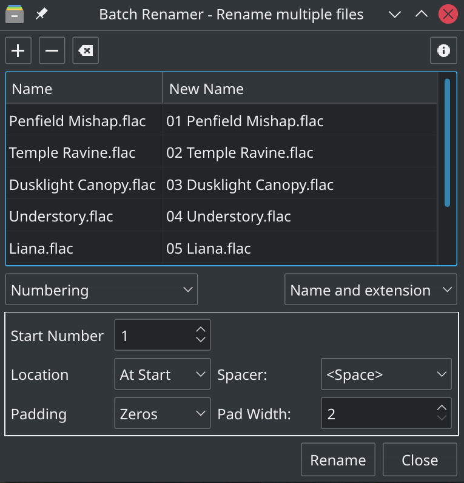

# Bionic Batch Renamer

A powerful batch file renaming utility built with the Qt technology stack.

Interface heavily inspired by [Thunar's 'bulk renamer'](https://docs.xfce.org/xfce/thunar/bulk-renamer/start) plugin.

#### Creation of installer:

- Build the release executable in QtCreator.

- Navigate to the ''Deb Packaging' directory and run ''MakeDeb' to create the .deb distribution package.

#### Installation of the executable:

- Double-click the .deb installation file and install via your package manager. The executable will be located at /usr/local/bin/Batch_Renamer.

- On KDE Plasma, the latest version may be installed from the KDE store from within the Dolphin File Manager. From the Dolphin menu select 'Settings->Configure Dolphin->Context Menu->Download New Services' and search for 'Bionic Batch Renamer.' This will add the option 'Batch rename' to the right-click menu in the file manager. 

#### Authors:

- Lee Cooper
